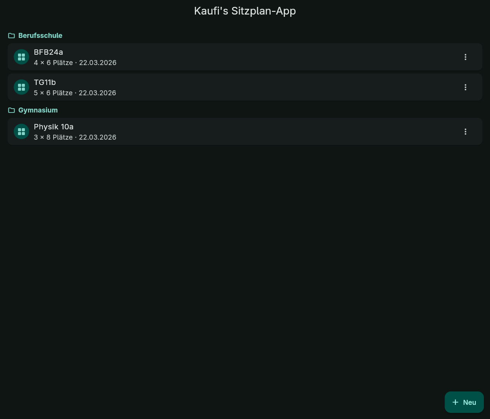
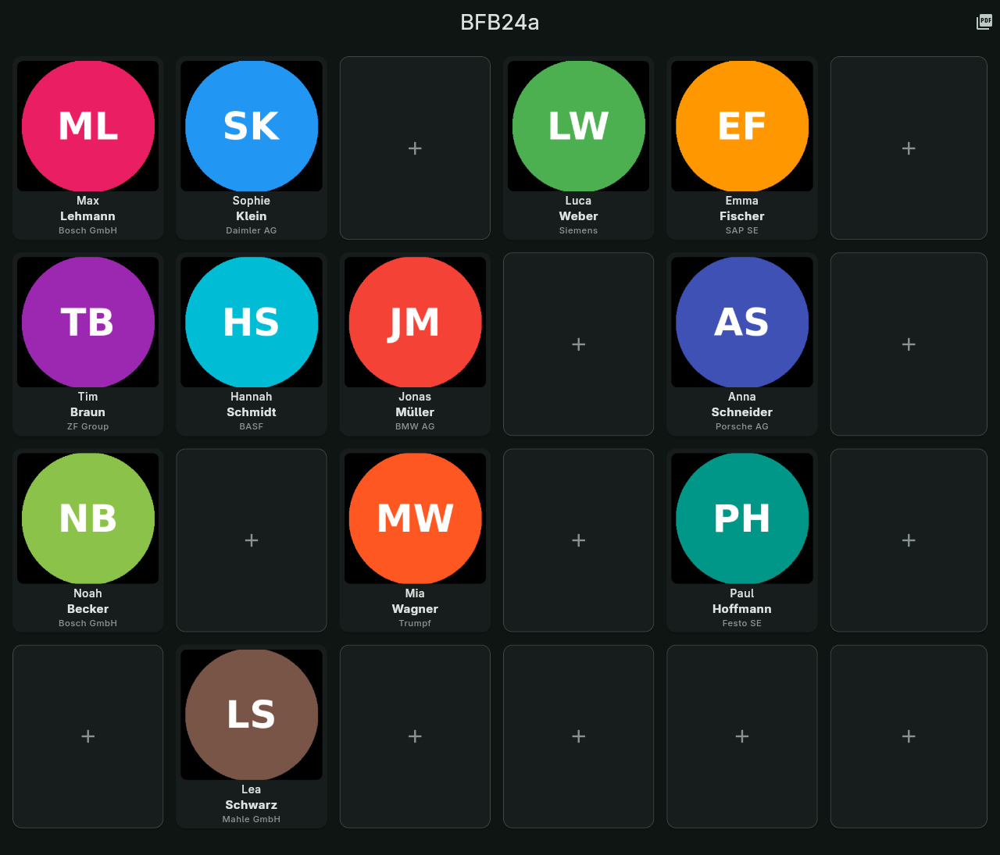
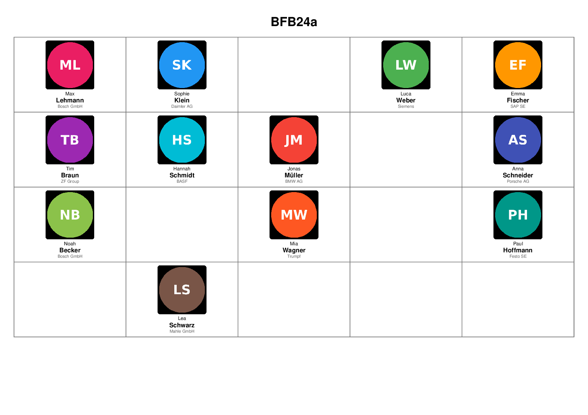

# Kaufi's Sitzplan-App

Eine lokale Flutter-App zum Erstellen, Bearbeiten und Drucken von Sitzplänen.

## Funktionen

- Sitzpläne mit frei wählbarer Reihen- und Spaltenzahl
- Schülerinnen und Schüler mit Vorname, Nachname, Foto und optionaler Zusatzinfo
- Gruppen/Klassen zum Sortieren mehrerer Sitzpläne
- Drag & Drop zum Verschieben oder Tauschen von Plätzen
- PDF-Export im A4-Querformat
- Dark Mode über das System-Theme

## Screenshots

| Hauptmenü | Editor | PDF |
|:--:|:--:|:--:|
|  |  |  |

## Datenschutz

Alle Daten bleiben lokal auf dem Gerät. Es gibt keinen Server, kein Login, keine Cloud-Synchronisierung und kein Tracking. Fotos und Sitzpläne werden im lokalen App-Datenverzeichnis gespeichert.

## Entwicklung

Voraussetzungen:

- Flutter SDK
- Linux, Windows oder Android als Zielplattform
- Optional: `ffmpeg` für Kameraaufnahmen auf Desktop-Systemen

```bash
flutter pub get
flutter run
flutter test
```

## Release

Aktuelle Version: `1.0.0`

GitHub Actions erstellt bei Tags wie `v1.0.0` automatisch Release-Artefakte für Linux, Windows, macOS, Android und iOS. Das iOS-Artefakt ist ohne Apple-Zertifikate unsigniert; für TestFlight oder App Store sind zusätzliche Signing-Secrets nötig. Die Android-APK nutzt aktuell die im Projekt konfigurierte Debug-Signierung für Release-Builds.

Build-Beispiele:

```bash
flutter build linux --release
flutter build windows --release
flutter build apk --release
```

## Lizenz

MIT
