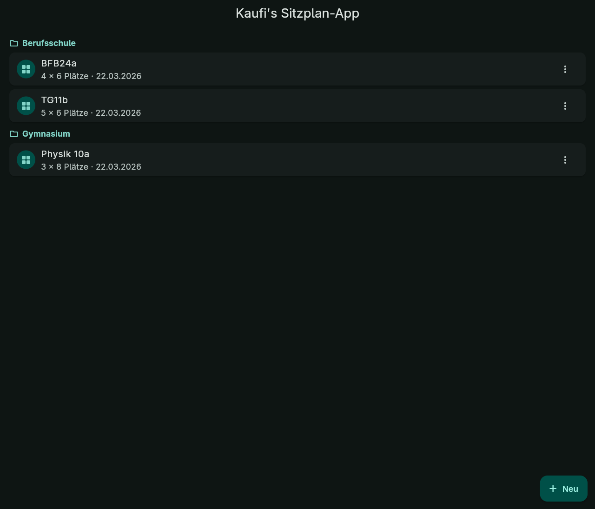
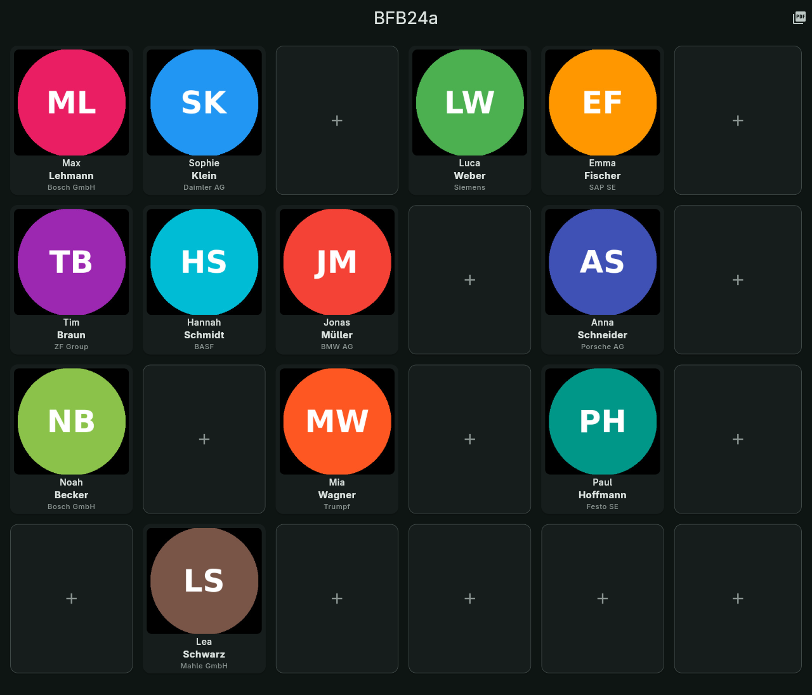
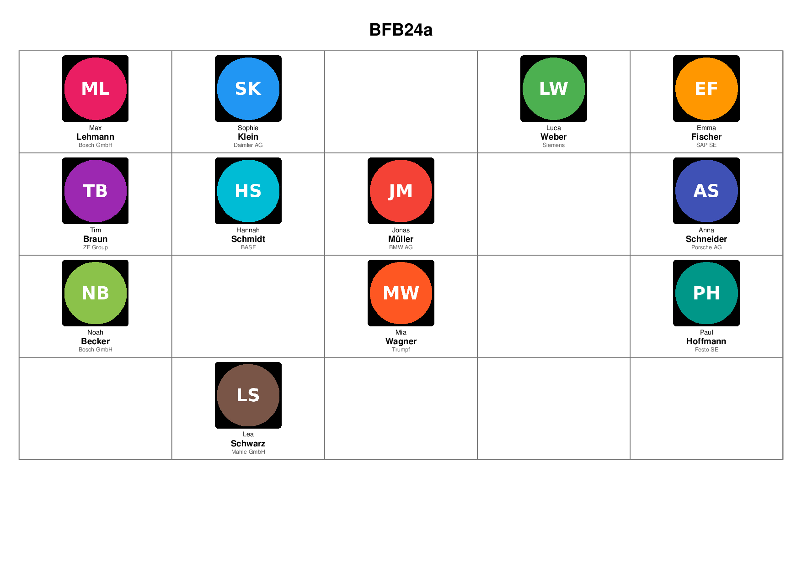

# Kaufi's Sitzplan-App

Eine lokale Flutter-App zum Erstellen, Bearbeiten und Drucken von Sitzplänen.

## Funktionen

- Sitzpläne mit frei wählbarer Reihen- und Spaltenzahl
- Schülerinnen und Schüler mit Vorname, Nachname, Foto und optionaler Zusatzinfo
- Automatischer Textmodus mit großer, einheitlicher Schrift, wenn ein Plan keine Fotos enthält
- Gruppen/Klassen zum Sortieren mehrerer Sitzpläne
- Drag & Drop zum Verschieben oder Tauschen von Plätzen
- Zufällige Sitzverteilung mit fixierbaren Schülerplätzen
- Mehrstufiges Rückgängig und Wiederholen für Platzänderungen
- Schnelleingabe mit „Speichern & weiter“
- Nachträglich anpassbare Raumgröße
- Kameraaufnahme auf Android, iOS, Windows, Linux und macOS
- PDF-Export im A4-Querformat
- Dark Mode über das System-Theme

## Screenshots

| Hauptmenü | Editor | PDF |
|:--:|:--:|:--:|
|  |  |  |

## Datenschutz

Alle Daten bleiben lokal auf dem Gerät. Es gibt keinen Server, kein Login, keine Cloud-Synchronisierung und kein Tracking. Fotos und Sitzpläne werden im lokalen App-Datenverzeichnis gespeichert.

## Entwicklung

Voraussetzungen:

- Flutter SDK
- Linux, Windows oder Android als Zielplattform
- Für lokale Desktop-Entwicklungsstarts optional `ffmpeg`; die fertigen Release-Pakete enthalten es bereits

```bash
flutter pub get
flutter run
flutter test
```

## Release

Aktuelle Version: `1.4.0`

GitHub Actions erstellt bei Tags wie `v1.4.0` automatisch Release-Artefakte für Linux, Windows, macOS, Android und iOS.

Desktop-Artefakte:

- Windows: `Sitzplan-1.4.0-Setup.exe`
- Linux: `Sitzplan-1.4.0-x86_64.AppImage`
- macOS: `Sitzplan-1.4.0-macos.dmg`
- Android: `Sitzplan-1.4.0-android.apk`

Der Windows-Installer und die macOS-DMG sind aktuell nicht signiert. Auf macOS kann Gatekeeper deshalb beim ersten Start eine Sicherheitsabfrage anzeigen. Das iOS-Artefakt ist ohne Apple-Zertifikate unsigniert; für TestFlight oder App Store sind zusätzliche Signing-Secrets nötig. Die Android-APK nutzt aktuell die im Projekt konfigurierte Debug-Signierung für Release-Builds.

Die Desktop-Pakete enthalten ein passendes FFmpeg-Kameramodul. Unter Windows und macOS wird die vorhandene Kamera automatisch erkannt; unter Linux wird das erste verfügbare `/dev/video*`-Gerät verwendet. Android und iOS nutzen die native Kamera des Systems. Beim ersten Aufnehmen kann das Betriebssystem nach der Kameraberechtigung fragen.

Build-Beispiele:

```bash
flutter build linux --release
flutter build windows --release
flutter build apk --release
```

## Lizenz

MIT

Die Desktop-Release-Pakete enthalten FFmpeg als separat ausgeführte Komponente unter GPL-3.0-or-later. Lizenz- und Buildhinweise liegen dem jeweiligen Paket als `FFMPEG-LICENSE.txt` und `FFMPEG-README.txt` bei.
